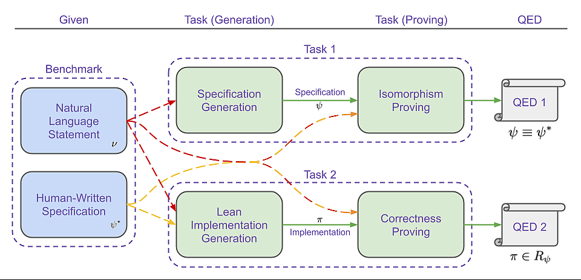

# CLEVER: Curated Lean Verified Code Generation Benchmark

## Overview

CLEVER is a benchmark suite for **end-to-end code generation and formal verification** in Lean 4, adapted from the HumanEval dataset. The goal is to move beyond test-case-driven evaluation by requiring models to generate not only implementations but also formal specifications and proofs — all verifiable by Lean’s type checker.



## Benchmark Focus

CLEVER evaluates models across a staged verification pipeline:

- **Task 1:** Generate a formal specification from a natural language description.
- **Task 2:** Prove semantic equivalence to a hidden ground-truth specification.
- **Task 3:** Synthesize a Lean implementation that satisfies the specification.
- **Task 4:** Prove the implementation's correctness against the reference specification.

Each step is independently verified, allowing fine-grained diagnosis of model performance.

## Key Features

- **Non-computable specifications** that prevent implementation leakage and enforce semantic reasoning.
- **Staged certification** design to isolate failures across spec generation, implementation, and proof.
- **Supports symbolic proof search** with agents like COPRA, enabling deeper proof automation analysis.

---

## 🚀 Submitting Your Solutions to CLEVER

To evaluate your LLM-generated solutions against the CLEVER benchmark, use the Python API to package and submit them as `LeanProblemView` objects. Each submission is compiled and verified using Lean 4, and results are returned as structured `ValidationResult` objects.

### 🔧 Steps

1. **Load the benchmark**:
   ```python
   from clever_bench.benchmark import Benchmark
   benchmark = Benchmark(is_sample=True)  # or is_sample=False for actual HumanEval problems in `src/lean4/human_eval`
   benchmark.load_all()
   ```

2. **Select a task** (e.g., proof generation):
   ```python
   from clever_bench.task import ProblemViewTask, TaskComponent
   task = ProblemViewTask(benchmark, TaskComponent.PROOF_GENERATION)
   ```

3. **Get a problem and fill in your solution**:
   ```python
   problem = task.get_view(3) # Abstraction to hide the staged problem details
   problem.implementation = "<your Lean implementation>"
   problem.correctness_proof = "<your proof>"
   ```

4. **Submit the solution**:
   ```python
   import asyncio
   result = asyncio.run(task.submit_async(problem, timeout_in_ms=30000))
   print(result.correctness_ok, result.error_message)
   ```

### ✅ Result

The returned `ValidationResult` will tell you whether your implementation compiled, and whether the proofs were accepted by Lean (i.e., no `sorry`).

CLEVER also supports multi-stage verification: the Python API automatically hides irrelevant fields during each task (e.g., only showing the natural language description field for spec generation), enabling clean task-specific prompting and evaluation.

This process allows you to validate your solutions programmatically—whether you're using LLMs, proof agents, or writing Lean by hand.


## Build Instructions
- Install Lean 4: https://leanprover.github.io/lean4/doc/quickstart.html
- Run `lake build clever` to build the project after changing the directory to `src/lean4`. OR use VS Code with Lean 4 extension to build the project.
- All the formalizations are in the `src/lean4/human_eval` directory.
- Some extra formalizations are provided in `src/lean4/sample_examples/` directory, some of which were used in prompts created for evaluating the benchmark.

## Paper

You can find the paper describing CLEVER at https://arxiv.org/abs/2505.13938.
```bibtex
@misc{thakur2025clever,
      title={CLEVER: A Curated Benchmark for Formally Verified Code Generation}, 
      author={Amitayush Thakur and Jasper Lee and George Tsoukalas and Meghana Sistla and Matthew Zhao and Stefan Zetzsche and Greg Durrett and Yisong Yue and Swarat Chaudhuri},
      year={2025},
      eprint={2505.13938},
      archivePrefix={arXiv},
      primaryClass={cs.LG},
      url={https://arxiv.org/abs/2505.13938}, 
}
```
